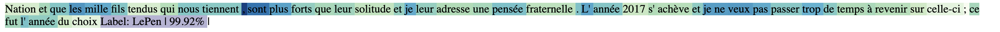
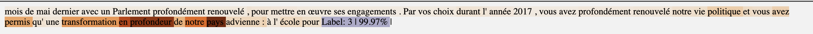

# Authorship Attribution 
This library helps you to deal with various tasks: 
- Train, Evaluate a model for text classification => Predict and Interpret new data
- Train your own Word Embeddings
- Compute sentence similarity 

## Installation 
Clone this repository and run 
```python
pip install -r requirements.txt
```

## Training

Before training, you have to define the hyperparamaters for your model => Go to ***aa/ressources/config/model_config.json*** and modify the hyperparameters or you can leave the default values.   

This example shows you how to train a model 

CNN Model
```python
python train.py --train_data aa/data/Campagne2017.csv --sep '\t' --model cnn --custom_emb w2v --output test_model
```
Attention Model 

```python
python train.py --train_data aa/data/Campagne2017.csv --sep '\t' --model attention --output test_model
```
For this tutorial, we serve Campagne2017.csv as training data (It is a French Corpus of the 2017 presidential election in france. There are 5 main candidates encoded with the labels (Melenchon, Hamon, Macron, Fillon, LePen) [Source](https://choosealicense.com/licenses/mit/)

### **Arguments:** 

**--train_data** : a csv file containing 2 columns 'labels' and 'texts' (without header, by default 1rst column will be labels and 2 column will be texts)
> **Note:** 10% of your training data will be served as validation data

**--sep** : seperator of your csv file (by default '\t') 

**--model**: choose the model you want to use for training. For this moment, we only support **cnn**, **attention** and **transformers**

To train the embeddings for your model, you have two options: 

1) Use the pretrained embeddings FastText by calling the argument **--lg** (the language you want to download the pretrained Embedding. For example: **--lg** fr for French Embeddings). For more information, visit [FastText](https://fasttext.cc/docs/en/crawl-vectors.html) website. By default, the dimension of this embeddings is set to 300. But if you want to reduce dimension, call **--reduce_dim** *new_value_dimension*

2) Train your own embedding: in this case, call **--custom_emb** (w2v: for word2vec or ft for FastText). You can set different hyperparameters for your embeddings in ***aa/ressources/config/emb_config.json*** or you can leave the default values. 


> **Note:**  **fastText** does significantly better on **syntactic tasks** as compared to the original Word2Vec, especially when the size of the training corpus is small. **Word2Vec** slightly outperforms fastText on **semantic tasks** though. The differences grow smaller as the size of the training corpus increases. For more information, please visit [here](https://radimrehurek.com/gensim/auto_examples/tutorials/run_fasttext.html). 

**---output** : name of folder you want to save your model (the folder will be saved in aa/output_models/). Example, if you pass --output model1 => your model will be found at aa/output_models/model1

## Evaluation/Prediction and Interpretation 
```python
python predict.py --model 'model1' --csv_file 'aa/data/Campagne2017test.csv' --deconv True
```

### Arguments 

**--model** : your model directory 

For evaluation/prediction, you can pass either a **sentence** or a **csv** file: 

1) **--sentence**: sentence to predict. In this case, **--target** (true label of the sentence) has to be called.

2) **--csv_file** : a csv file containing 2 columns 'labels' and 'texts' (without header, by default 1rst column will be labels and 2 column will be texts). 
**--sep** : seperator of your csv file (by default '\t') 

**--deconv** :  bool. (Whether you want to use the deconvolution technique to highlight the most important patterns which contribute to the decision of your model) 



**--attention** :  bool. (Whether you want to highlight the most important patterns which contribute to the decision of your model) 



**---output_csv** :  your output csv file if you want to output a csv file containing 4 columns Text, True Label, Predict Label, Predictions Score. 


## Compute sentence similarity 

### Case 1: Given a QUERY, find 5 most similar sentences in train_data 

### Examples: 
```python
python sentencesimilarity.py --train_data aa/data/Campagne2017.csv --query "vœux pour l' année 2018 . Je vous espère en famille , au milieu de vos proches , de celles et ceux qui vous aiment . Je sais aussi que certains d' entre vous sont aujourd' hui au travail parce qu' ils font partie des forces armées ou des forces"
```

> Output:  
> **Query**: vœux pour l' année 2018 . Je vous espère en famille ,
> au milieu de vos proches , de celles et ceux qui vous aiment . Je sais
> aussi que certains d' entre vous sont aujourd' hui au travail parce
> qu' ils font partie des forces armées ou des forces  
> 
> Top 5 most similar sentences in corpus:  
> Mes chers amis , C' est un plaisir de me retrouver parmi vous et puisque l' heure est encore aux vœux , je souhaite à chacune et chacun de vous une bonne année 2017 . Soyez heureux , prenez soin de vous et de ceux que vous aimez , soyez **Fillon (Score: 0.9643)**  

> que j' aime et à vous tous , j' adresse mes vœux de bonheur et de succès pour cette nouvelle année qui commence . Je suis parmi vous , avec le cœur encore serré par la tragédie du 14 juillet . De ce souvenir monte en moi une volonté inflexible **Fillon (Score: 0.9587)**  

> Du fond du coeur , merci à vous tous et à vous toutes . Merci à tous les élus qui m' accompagnent et qui sont ici présents . Je suis heureux d' être avec vous , dans cette belle Auvergne , dont l' exceptionnelle chaîne volcanique mériterait bien d' être **Fillon (Score: 0.9578) **

> Mes amis , mes chers compatriotes , C' est à Nice et c' est avec vous que je repars en campagne . A cette ville que j' aime et à vous tous , j' adresse mes vœux de bonheur et de succès pour cette nouvelle année qui commence . Je **Fillon (Score: 0.9526) **

> chacune et chacun de vous une bonne année 2017 . Soyez heureux , prenez soin de vous et de ceux que vous aimez , soyez passionnés , ne renoncez pas à vos rêves , et puisque vous avez la France au cœur , engagez -vous pour elle , mobilisez -vous **Fillon (Score: 0.9486)**

### Arguments:
 
### Case 2: Compute the similarity of 2 queries

```python
python sentencesimilarity.py --query1 "Je crois très profondément que l' Europe peut devenir cette puissance économique , sociale , écologique et scientifique qui pourra faire face à la Chine , aux Etats-Unis en portant ces valeurs qui nous ont faits et qui sont notre histoire commune . J' ai besoin de votre détermination pour" --query2 "vœux pour l' année 2018 . Je vous espère en famille , au milieu de vos proches , de celles et ceux qui vous aiment . Je sais aussi que certains d' entre vous sont aujourd' hui au travail parce qu' ils font partie des forces armées ou des forces"
```

## Visualization - Topic Modeling


## Contributing


## License
[MIT](https://choosealicense.com/licenses/mit/)


